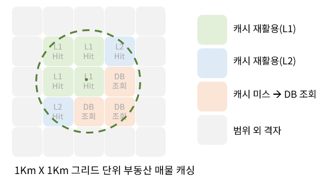
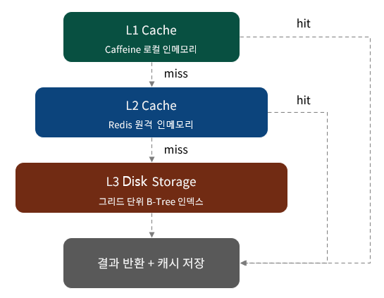
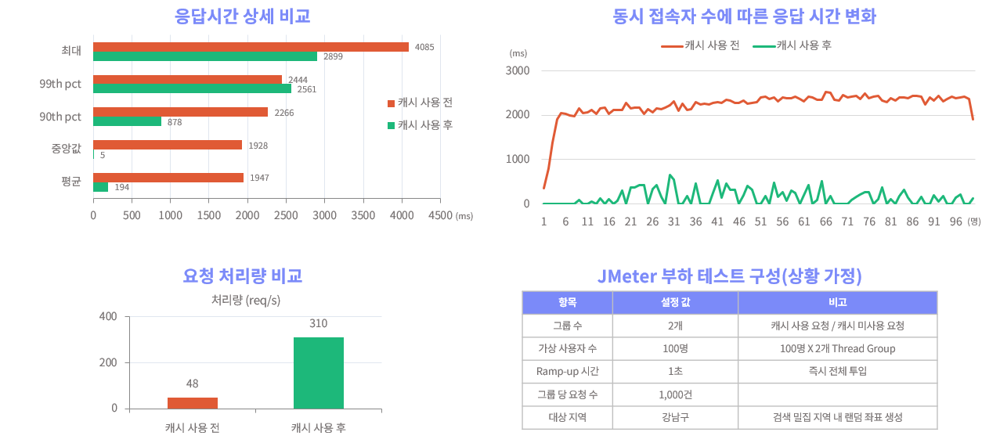
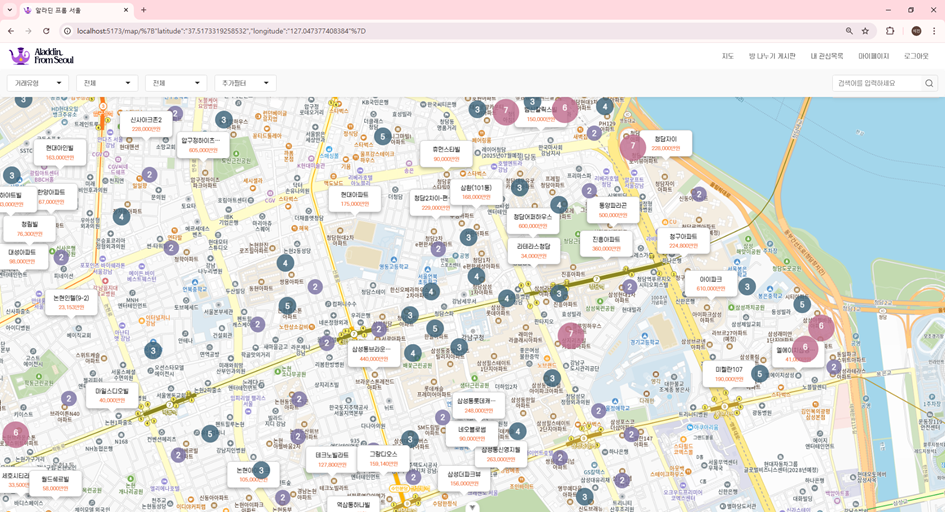
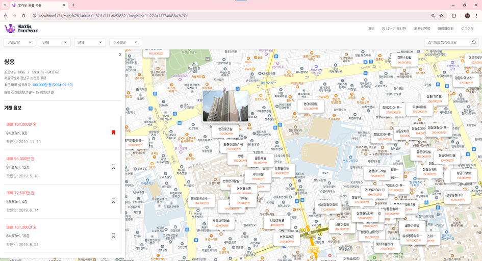
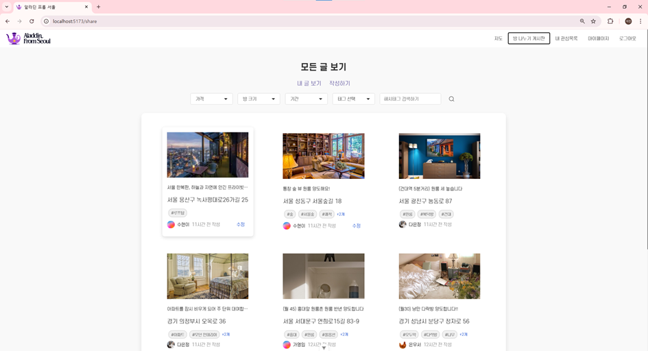
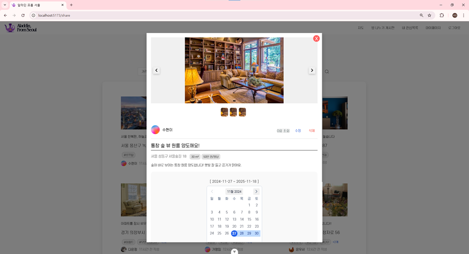
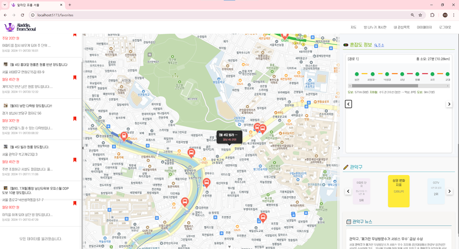

# 🏠 Aladdin From Seoul

> **공간 데이터 격자 바인딩 및 캐시 계층화 기반 조회 성능 개선**  
> 청년 주거마련 문제 해결을 위한 부동산 매물 조회 및 양도 활성화 플랫폼

<br>

## ⭐ 핵심 기능 상세

### 📦 지도 범위 내 매물 조회 성능 개선

#### 문제
실시간 지도 기반 매물 조회 시, 사용자의 미세한 위치 이동마다 위/경도 좌표 기반 RDB 공간 인덱스 탐색이 발생하여 DB 부하가 가중

#### 해결 1 — 격자화(Grid Partitioning) 기반 데이터 바인딩

| 전략 | 내용 |
|------|------|
| 캐시 유닛 정의 | 1km × 1km 단위의 지도 영역을 하나의 격자 유닛으로 정의 |
| 좌표 정규화 | 위/경도 좌표를 격자 중앙값으로 변환해 고유한 캐시 Key로 매핑 |
| 격자 단위 패키징 | 해당 격자 내 모든 매물 정보를 리스트 형태로 캐싱 |
| 캐시 히트율 극대화 | 미세한 위치 이동에도 동일 격자를 재사용 |



#### 해결 2 — 캐시 계층화 전략

```
L1 Cache (Caffeine)      로컬 인메모리, 네트워크 없이 즉시 조회
         ↓ miss
L2 Cache (Redis)         공유 인메모리, 서버 재시작·확장 시 재활용
         ↓ miss
L3 (RDB + B-Tree 인덱스)  캐시 미스 격자만 1회 조회 후 캐싱
```



#### 결과

| 지표 | 캐시 적용 전 | 캐시 적용 후 | 개선율 |
|------|------------|------------|--------|
| 평균 응답시간 | 1,947 ms | 194 ms | **90% 단축** |
| 처리량 | 48 req/s | 310 req/s | **6.5배 향상** |
| 99th percentile | 4,085 ms | 2,561 ms | 37% 단축 |

<br>

### 📊 JMeter 부하 테스트 구성

| 항목 | 설정 값 | 비고 |
|------|--------|------|
| 그룹 수 | 2개 | 캐시 사용 요청 / 캐시 미사용 요청 |
| 가상 사용자 수 | 100명 | 100명 × 2개 Thread Group |
| Ramp-up 시간 | 1초 | 즉시 전체 투입 |
| 그룹 당 요청 수 | 1,000건 | |
| 대상 지역 | 강남구 | 검색 밀집 지역 내 랜덤 좌표 생성 |



<br>

### 🔍 TRIE 기반 실시간 검색어 자동완성

TRIE 자료구조를 활용해 사용자가 입력하는 즉시 검색어를 자동완성으로 추천

<br>

### 🚉 체감 혼잡도 알고리즘

지하철 혼잡도 공공데이터를 기반으로, **연속 혼잡 구간** 및 **환승역**을 종합적으로 고려한 실제 체감 혼잡도를 계산하여 제공

<br>

## 🎬 시연 영상

[](https://youtu.be/dGr2k3wmqPE)

<br>

## 👥 개발 인원

| 역할 | 이름 | GitHub |
|------|------|--------|
| Backend | 배석진 | [@Setto1044](https://github.com/Setto1044) |
| Frontend | 이은비 | [@led156](http://github.com/led156) |

<br>

## 📅 개발 기간

**2024.10.10 ~ 2024.11.27 (5주)**

<br>

## 🛠️ 기술 스택

### Backend


### Frontend


<br>

## ✨ 서비스 기능

| 기능 | 설명 |
|------|------|
| 🗺️ 지도 기반 매물 조회 | 지도 위에서 직관적으로 부동산 매물 탐색 |
| 💰 시세 확인 및 북마크 | 매물 시세 조회 및 관심 매물 저장 |
| 🚇 출퇴근 혼잡도 제공 | 매물과 직장 사이의 출퇴근 실시간 혼잡도 안내 |
| 🏪 주변 상권 분석 | 매물 인근 상권 현황 및 교통정보 제공 |
| 📋 양도 게시판 | 전전세·단기 매물 양도 커뮤니티 |

<br>

## 📸 서비스 화면

### 🤖 AI 주거지역 추천


AI 기반으로 사용자의 조건에 맞는 최적의 주거지역을 추천합니다.

---

### 🗺️ 지도 매물 조회


지도 위에 매물을 마커로 표시하여 위치 기반으로 탐색할 수 있습니다.

---

### 📄 매물 상세 정보


매물의 상세 정보, 거래내역을 한눈에 확인할 수 있습니다.

---

### 📋 양도 게시판


전전세·단기 매물을 직접 올리고 거래할 수 있는 커뮤니티 게시판입니다.

---

### 📝 양도 상세


양도 매물의 상세 정보를 등록하고 문의할 수 있습니다.

---

### 🔖 저장 매물 조회


북마크한 관심 매물의 인근 상권 현황 및 교통정보를 확인할 수 있습니다.

<br>

## 📂 프로젝트 구조

```
core-service/
├── src/main/java/com/aladdin/core_service/
│   ├── config/
│   │   ├── CaffeineConfig.java           # L1 로컬 인메모리 캐시 설정 (10분 TTL, 최대 100,000건)
│   │   └── RedisConfig.java              # L2 Redis 캐시 설정 (Jackson 직렬화)
│   ├── controller/
│   │   └── HouseController.java          # 매물 조회 REST API
│   ├── dto/
│   │   ├── HouseMapSearchRequestDto      # 지도 조회 요청 (위/경도, 범위)
│   │   ├── HouseMapSearchResponseDto     # 지도 조회 응답
│   │   ├── HouseSummaryDto              # 격자 캐싱 단위 매물 요약 DTO
│   │   └── MapSearchScope               # 줌 레벨별 조회 범위 Enum
│   ├── entity/
│   │   ├── HouseInfo.java               # 매물 기본 정보
│   │   └── HouseDealsStat.java          # 매물 거래 통계
│   ├── repository/
│   │   ├── HouseCustomRepository.java
│   │   └── HouseRepositoryImpl.java     # QueryDSL 기반 격자 범위 조회, 클러스터 집계
│   ├── service/
│   │   └── HouseServiceImpl.java        # L1→L2→L3 캐시 계층 조회 핵심 로직, 격자 키 생성
│   └── util/trie/
│       ├── AutocompleteManager.java
│       ├── AutocompleteService.java
│       ├── RedisAutocompleteService.java
│       └── TrieAutocompleteService.java  # TRIE 기반 실시간 자동완성
└── build.gradle
```

<br>

## ⚙️ 실행 방법

```bash
# 저장소 클론
git clone https://github.com/Setto1044/aladdin-from-seoul.git
cd aladdin-from-seoul

# Redis 실행 (Docker)
docker-compose up -d redis

# 애플리케이션 실행
./gradlew bootRun
```
